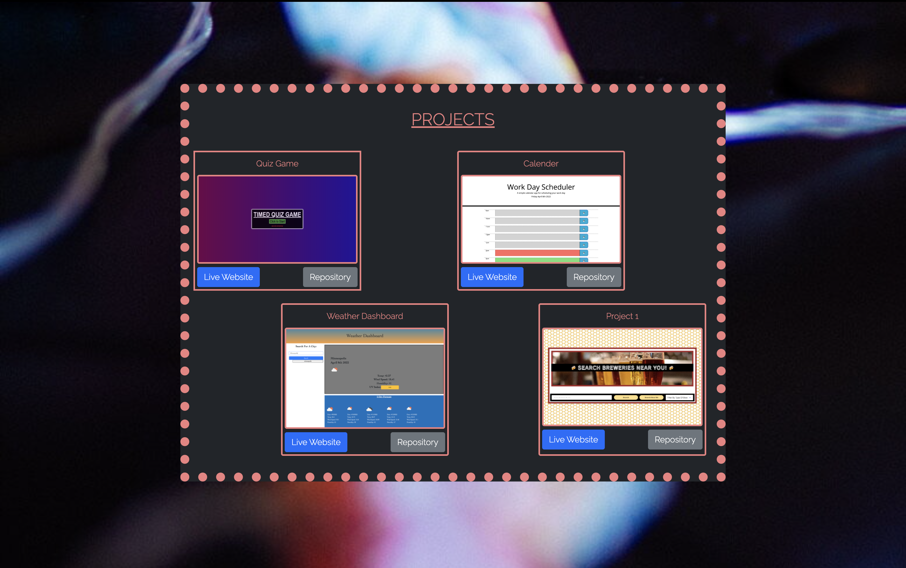
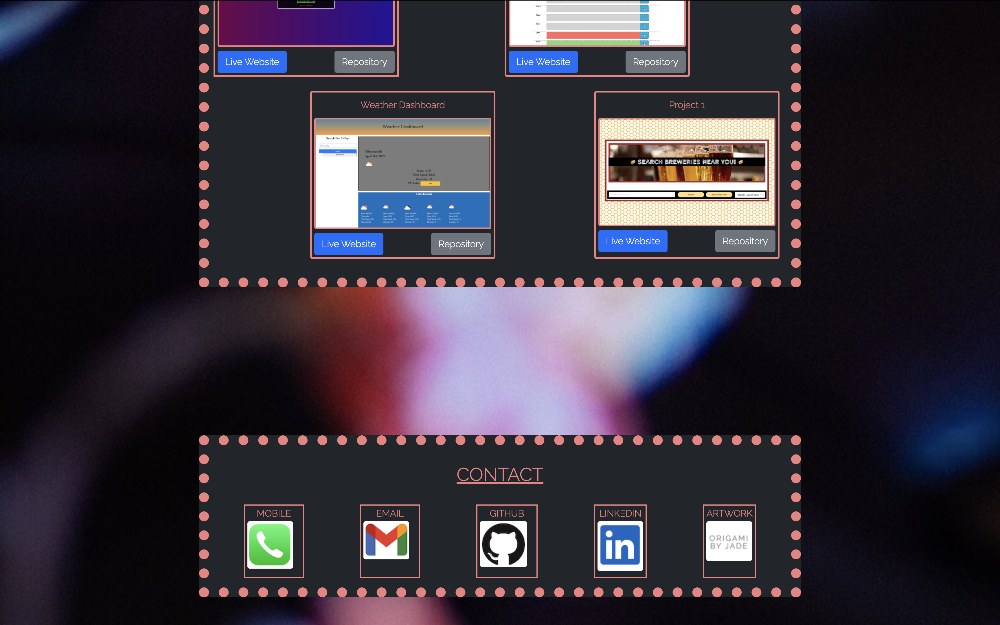

# Professional Portfolio 

## Welcome to my updated Professional Portfolio!

### On this updated version of my portfolio, I decided to change the color theme and layout struture and design! Now that I have a better understanding how to style applications. 

### Once users view my live application for my portfolio, they will see the navigation bar evenly centered, where clicking on certain links will direct them to different sections of the page. Not to mention, who doesn't like to have a warm "Welcome" either!

### In my "About Me" section, I have a brief biography, as well as a picture of myself and an icon for users to view and download my resume if they would like. 

### For the "Projects" section, I have four images with button to the live deployment of the web applications, as well as buttons to the repositories I presently have pinned on my GitHub profile. All repositories that are pinned have at least 20 commits and the MIT License files created and merged as well. 

### I then created separate functions for the onClick event of each button to bring the user to the links of whatever past projet they were viewing.

### At the bottom of my application, I have icons with links to various way of contacting me. I also have an icon for users to visit my other website and view perivous creative work I have made in the past.

[Click here to view the live web application](https://jadehuynh.github.io/professional-portfolio/)

